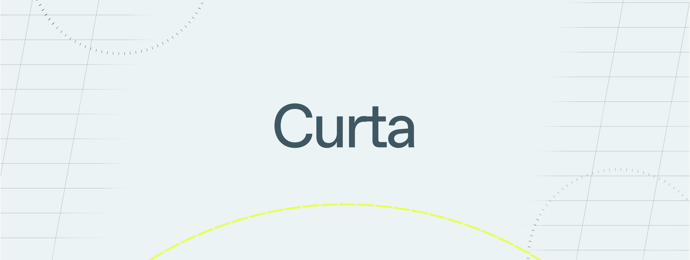

# Curta

[![Telegram Chat][tg-badge]][tg-url]

A performant, 100% open-source, contributor-friendly zero-knowledge virtual machine (zkVM) that can prove the execution of arbitrary Rust (or any LLVM-compiled language) programs.



Curta is inspired by the open-source software movement and takes a collaborative approach towards building the best zkVM for rollups, coprocessors and other ZKP applications. We envision a diversity of contributors integrating the latest ZK innovations, creating a zkVM that is _performant_, _customizable_ and will stand the _test of time_.

**[Install](https://succinctlabs.github.io/curta/getting-started/install.html)**
| [Docs](https://succinctlabs.github.io/curta)
| [Examples](https://github.com/succinctlabs/curta/tree/main/examples)

[tg-badge]: https://img.shields.io/endpoint?color=neon&logo=telegram&label=chat&url=https://tg.sumanjay.workers.dev/succinct_curta
[tg-url]: https://t.me/succinct_curta

## Install

Make sure you have [Rust](https://www.rust-lang.org/tools/install) installed. Open your terminal and run the following command:

```
curl -L https://curta.succinct.xyz | bash
```

This will install `curtaup`, then simply follow the instructions on the screen, which will make the `curtaup` command available in your CLI.
Running `curtaup` will install the latest (nightly) precompiled binary for `cargo-prove` and the custom rust toolchain for the zkVM.

## Quickstart

Create a new project:

```
cargo prove new fibonacci
```

Build a binary that can be run in the zkVM:

```
cd program && cargo prove build
```

Generate and verify the execution of the binary:

```
cd script && RUSTFLAGS="-C target-cpu=native" cargo run --release
```

Note that the `RUST_LOG` and `RUST_TRACER` enviroment variables can be set to different status levels to get more fine-grained logging and debugging information.

## Build

If you want to build the `cargo-prove` CLI from source, run the following commands:

```
git clone https://github.com/succinctlabs/curta.git
cd vm
cd cli
cargo install --locked --path .
```

You will need to install our custom toolchain to compile programs. If you are on a supported architecture
(i.e., MacOS or Linux), install the toolchain using a prebuilt release.

```
cargo prove install-toolchain
```

Otherwise, you will need to build the toolchain from source.

```
cargo prove build-toolchain
```

## Development

We recommend you install the [rust-analyzer](https://marketplace.visualstudio.com/items?itemName=rust-lang.rust-analyzer) extension.
Note that if you use `cargo prove new` inside a monorepo, you will need to add the manifest file to `rust-analyzer.linkedProjects` to get full IDE support.

## Acknowledgements

We would like to acknowledge the projects below whose previous work has been instrumental in making this project a reality.

- [Plonky3](https://github.com/Plonky3/Plonky3): The Curta zkVM's prover is powered by the Plonky3 toolkit.
- [Valida](https://github.com/valida-xyz/valida): The Curta zkVM cross-table lookups, prover, borrow macro, and chip design, including constraints, are inspired by Valida.
- [RISC0](https://github.com/risc0/risc0): The Curta zkVM rust toolchain, install/build scripts, and our RISCV runtime borrow code from RISC0.
