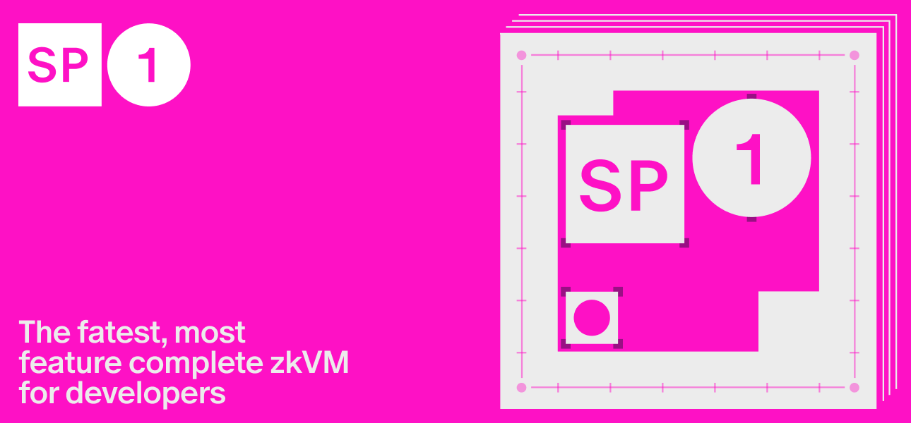

# SP1

*Documentation for SP1 users and developers*.

[![Telegram Chat][tg-badge]][tg-url]

SP1 is a performant, open-source zero-knowledge virtual machine (zkVM) that verifies the execution of arbitrary Rust (or any LLVM-compiled language) programs. 

[tg-badge]: https://img.shields.io/endpoint?color=neon&logo=telegram&label=chat&url=https%3A%2F%2Ftg.sumanjay.workers.dev%2Fsuccinct%5Fsp1
[tg-url]: https://t.me/+AzG4ws-kD24yMGYx

SP1 has undergone multiple audits from leading ZK security firms and is currently used in production by many top blockchain teams.

## The future of ZK is writing normal code

Zero-knowledge proofs (ZKPs) are one of the most critical technologies to blockchain scaling, interoperability and privacy. But, historically building ZKP systems was extremely complicated--requiring large teams with specialized cryptography expertise and taking years to go to production. 

SP1 provides a performant, general-purpose zkVM that enables **any developer** to use ZKPs by writing normal code (in Rust), and get cheap and fast proofs. SP1 will enable ZKPs to become mainstream, introducing a new era of verifiability for all of blockchain infrastructure and beyond.

## SP1 enables a diversity of use-cases

ZKPs enable a diversity of use-cases in blockchain and beyond, including:

* Rollups: Use SP1 to generate a ZKP for the state transition function of your rollup and connect to Ethereum, Bitcoin or other chains with full validity proofs or ZK fraud proofs.
* Interoperability: Use SP1 for fast-finality, cross rollup interoperability
* Bridges: Use SP1 to generate a ZKP for verifying consensus of L1s, including Tendermint, Ethereum’s Light Client protocol and more, for bridging between chains.
* Oracles: Use SP1 for large scale computations with onchain state, including consensus data and storage data.
* Aggregation: Use SP1 to aggregate and verify other ZKPs for reduced onchain verification costs.
* Privacy: Use SP1 for onchain privacy, including private transactions and private state.
