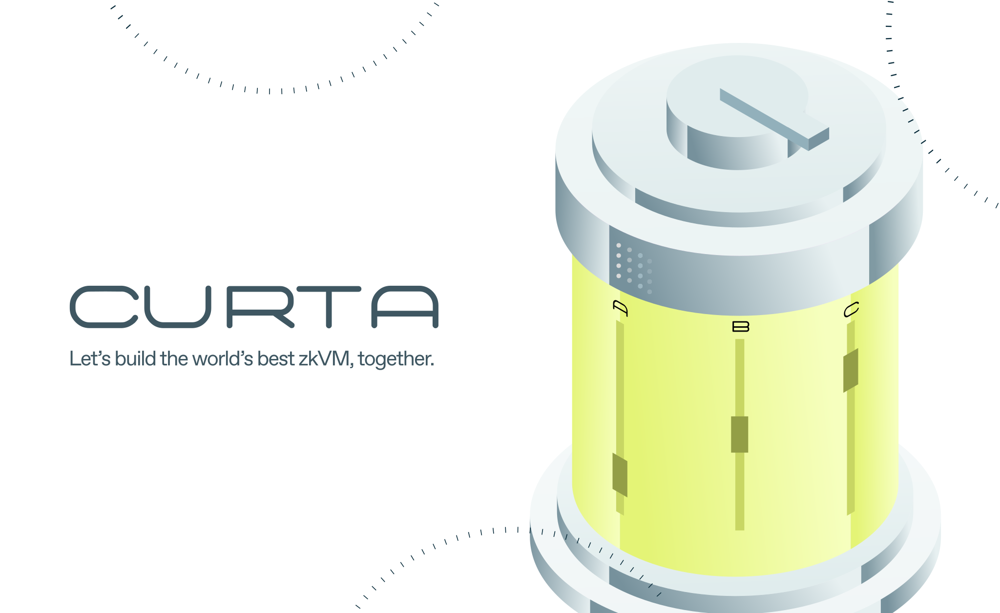

# Curta

[![Telegram Chat][tg-badge]][tg-url]

*Documentation for Curta zkVM users and developers*.

Curta zkVM is the first performant, 100% open-source, contributor-friendly zero-knowledge virtual machine (zkVM) that verifies the execution of arbitrary Rust (or any LLVM-compiled language) programs. 

[tg-badge]: https://img.shields.io/endpoint?color=neon&logo=telegram&label=chat&url=https%3A%2F%2Ftg.sumanjay.workers.dev%2Fsuccinct%5Fcurta
[tg-url]: https://t.me/succinct_curta

## The future of truth is programmable

**The future of ZK is writing normal code.**  Zero-knowledge proofs (ZKPs) are a powerful primitive that will enable a new generation of more secure, scalable and innovative blockchain architectures that rely on truth not trust. But ZKP adoption has been held back because it is “moon math”, requiring specialized knowledge in obscure ZKP frameworks and hard to maintain one-off deployments. 

General-purpose zkVMs, like Curta, will obsolete the current paradigm of specialized teams hand rolling their own custom ZK stack and create a future where all blockchain infrastructure, including rollups, bridges, coprocessors, and more, utilize ZKPs via **maintainable software** written in Rust (or other LLVM-compiled languages).

## Built from day one to be customizable and maintained by a diverse ecosystem of contributors

Curta zkVM is 100% open-source (MIT / Apache 2.0) with no code obfuscation and built to be contributor friendly, with all development done in the open. Unlike existing zkVMs whose constraint logic is closed-source and impossible to modify, Curta is modularly architected and designed to be customizable from day one. This customizability (unique to Curta) allows for users to add “precompiles” to the core zkVM logic that yield substantial performance gains, making Curta’s performance not only SOTA vs. existing zkVMs, but also competitive with circuits in a variety of use-cases.
