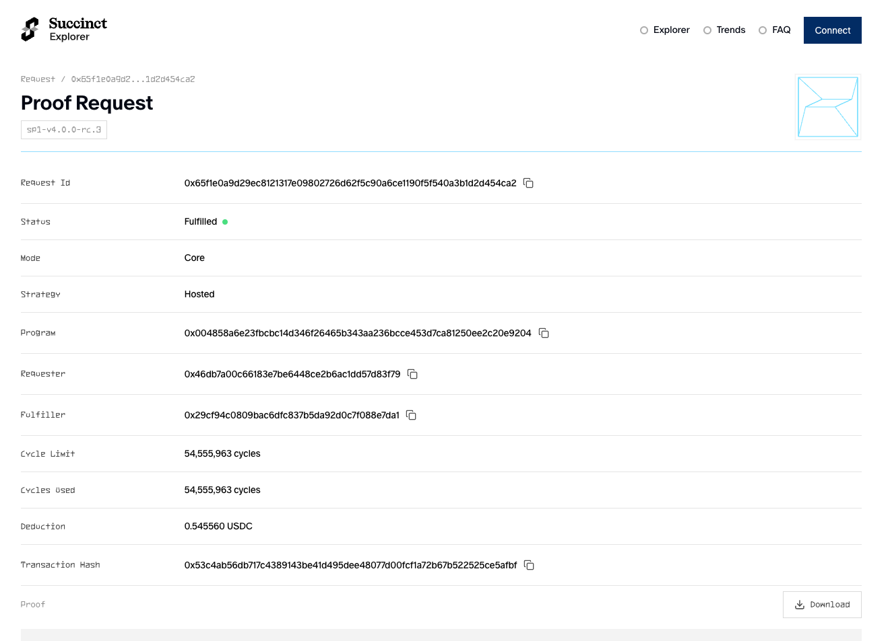

# Prover Network: Usage

> **See [Supported Versions](./versions.md) for the currently supported versions of SP1 on the Prover Network.**

## Sending a proof request

To use the prover network to generate a proof, you can run your script that uses `sp1_sdk::ProverClient` as you would normally but with additional environment variables set:

```rust
// Generate the proof for the given program.
let client = ProverClient::from_env();
let (pk, vk) = client.setup(ELF);
let mut proof = client.prove(&pk, &stdin).run().unwrap();
```

```sh
SP1_PROVER=network NETWORK_PRIVATE_KEY=... RUST_LOG=info cargo run --release
```

- `SP1_PROVER` should be set to `network` rather than the default `cpu` when using the prover network. This variable allows you to switch between the CPU and network provers.

- `NETWORK_PRIVATE_KEY` should be set to your [private key](./key-setup.md). You will need
  to be using a [whitelisted](../prover-network) key to use the network.

When you call any of the prove functions in ProverClient now, it will first simulate your program, then wait for it to be proven through the network and finally return the proof.

## View the status of your proof

You can view your proof and other running proofs on the [explorer](https://network.succinct.xyz/). The page for your proof will show details such as the stage of your proof and the cycles used. It also shows the vk hash of the program.



## Advanced Usage

If you are using the prover network in a production system, or otherwise want to use advanced features, you should use `sp1_sdk::NetworkProver` directly.

Advanced features include:
* Skipping local simulation
* Requesting a proof, which returns a proof ID, and then waiting for the proof to be fulfilled
* Async support
* Requesting a proof using a custom fulfillment strategy, such as for reserved prover network capacity

```rust
use sp1_sdk::{network::FulfillmentStrategy, Prover, ProverClient};
use std::time::Duration;

let prover = ProverClient::builder().network().build();
let (pk, vk) = prover.setup(ELF);

// Request proof and get the proof ID immediately
let request_id = prover.prove(&pk, &stdin).groth16().skip_simulation(true).request_async().await.unwrap();
println!("Proof request ID: {}", request_id);

// Wait for proof complete with a timeout
let proof = prover.wait_proof(request_id, Some(Duration::from_secs(60 * 60))).await.unwrap();

// Request a proof with reserved prover network capacity and wait for it to be fulfilled
let proof = prover
    .prove(&pk, &stdin)
    .groth16()
    .skip_simulation(true)
    .strategy(FulfillmentStrategy::Reserved)
    .run_async()
    .await
    .unwrap();

// Request a proof and then block immediately (up to a timeout) until the proof is fulfilled
let proof = prover
    .prove(&pk, &stdin)
    .groth16()
    .skip_simulation(true)
    .fulfillment_strategy(FulfillmentStrategy::Reserved)
    .timeout(Duration::from_secs(60 * 60))
    .run()
    .unwrap();
```
